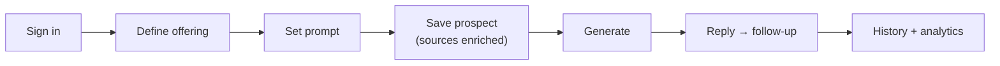
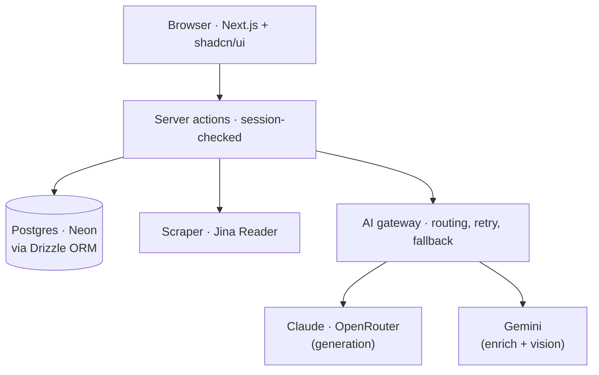

# Pinged

**Cold outreach that reads like you actually did your homework.**


**[Live app](https://ping-ed.vercel.app/)** · **[Video walkthrough](https://REPLACE-WITH-YOUR-VIDEO-LINK)**

Drop in a prospect, a URL or a LinkedIn screenshot, and Pinged writes outreach that references what is actually true about them, in your voice. They reply, you paste it back, and it continues the thread.

The idea behind every decision: this is a **context-assembly pipeline, not a CRUD app**. One call does the work, and the whole product exists to make that call good:

```
generate(offering, prompt, prospectContext, history) → message
```

---

## How it works



### 1. Sign in
Email and password via Better Auth. Every offering, prompt, prospect, and message is scoped to the signed-in user, checked on every query.

### 2. Define an offering
What you are selling. Build it by scraping one or more URLs, typing it yourself, or both. Keep multiple offerings and pick one per message. An inline AI explainer tells you what an offering is and how to make it strong.

### 3. Set a prompt
The system prompt that drives generation: tone, length, angle, how to open and close. Three presets are seeded, you can write your own and set a default, and an inline explainer helps you write a good one.

### 4. Save a prospect
Saved once, reused across offerings. Add any combination of sources with no fixed format: LinkedIn screenshot, GitHub, personal site, company URL, other URL, or free text. Paste anything and the type is detected. Each source is enriched the moment it is saved, with live status: Pending, Enriching, Enriched, or Failed.

### 5. Generate
Pick an offering, a prompt, and a prospect. The app stitches the prospect's distilled context with the offering and prompt and writes a message for that one person. Rate it, favourite it, copy it, delete it, or regenerate with a one-line angle. Every generation is saved.

### 6. Handle the reply
Paste what they wrote back. The follow-up replays the entire thread through the same call, so it answers what they actually said and keeps the tone. The full back-and-forth stays visible.

### 7. Review and analytics
Every conversation is saved per prospect as a full transcript. A simple analytics view shows total messages, prospects saved, top offerings, and conversations that got a reply.

---

## Architecture

One **Next.js** (App Router) app in **TypeScript**, deployed on **Vercel**. The UI, the server logic, the AI layer, and the database access live in one codebase. A request flows like this:



**Data and auth.** Schema and queries run through **Drizzle ORM** on **Postgres (Neon)**. **Better Auth** handles email/password, and the user id from the validated session is checked inside every server action, not only in middleware, so the trust boundary sits at the handler.

**Two-phase AI.** Sources are enriched once, the moment they are saved: **Jina Reader** turns a URL into clean markdown, an LLM distills it to tight facts, and screenshots go through a vision model. The result is stored as `extracted_context`. Generation only stitches that ready context, so it is fast and never re-scrapes.

**Provider abstraction.** Every model call goes through one gateway: canonical types, per-provider adapters, a routing table, retry, and fallback. **Claude Sonnet (via OpenRouter)** writes the graded messages, **Gemini (free tier)** handles enrichment and vision, and swapping a model for a task is a one-line edit. If OpenRouter fails, it falls back to Gemini automatically.

**Quality layer.** A humanize pass strips AI tells and hard-bans em dashes, in the prompt and again in code. The user's prompt is sent as the system prompt, so changing it visibly changes the output. UI is **Tailwind + shadcn/ui**.

---
 
## Real examples
 
Real, unedited output from the deploy. Expand each step.
 
<details>
<summary><b>The offering</b></summary>

</details>
<details>
<summary><b>The prompts</b></summary>

</details>
<details>
<summary><b>The prospect</b></summary>

</details>
<details>
<summary><b>Generated message</b></summary>

</details>
<details>
<summary><b>Reply follow-up</b></summary>
The prospect replied, and the follow-up replays the whole thread:
 

</details>
<details>
<summary><b>Same prospect, switched to Technical Peer</b> (shows customization)</summary>
Same offering, same prospect, only the prompt changed.
 

</details>

<details>
<summary><b>Pinged's follow-up conversation history (replays the whole conversation thread):</summary>

</details>

---

## Run locally

```bash
git clone https://github.com/darcy2002/Ping-ed
cd pinged
npm install
npx drizzle-kit migrate
npm run dev          # http://localhost:3000
```

Copy `.env.example` to `.env.local` and fill in the values first.

## What I'd build next
- [ ] Global message search across all prospects
- [ ] Streaming generation
- [ ] Reply-rate trends over time
- [ ] Resume a conversation from the Generate screen
- [ ] Firecrawl fallback scraper (the interface is already there)
